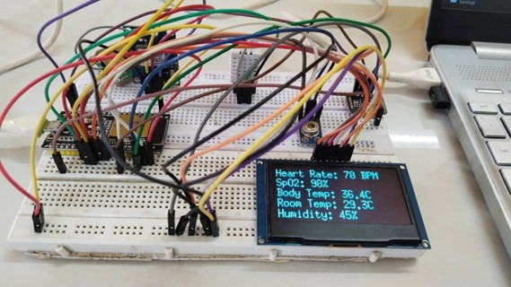
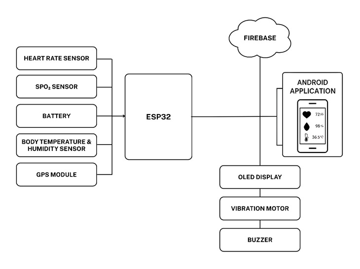
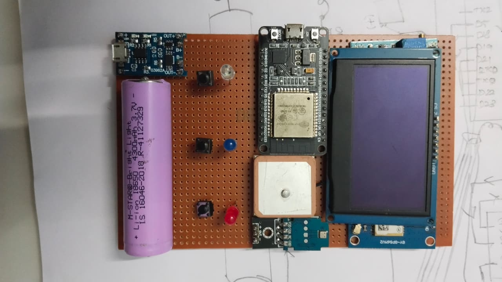
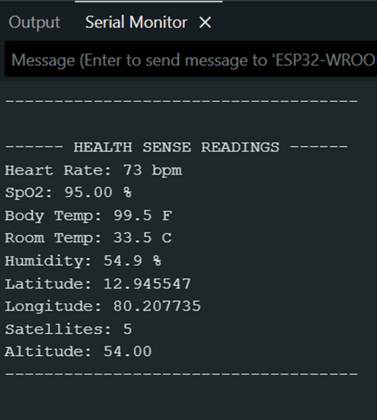
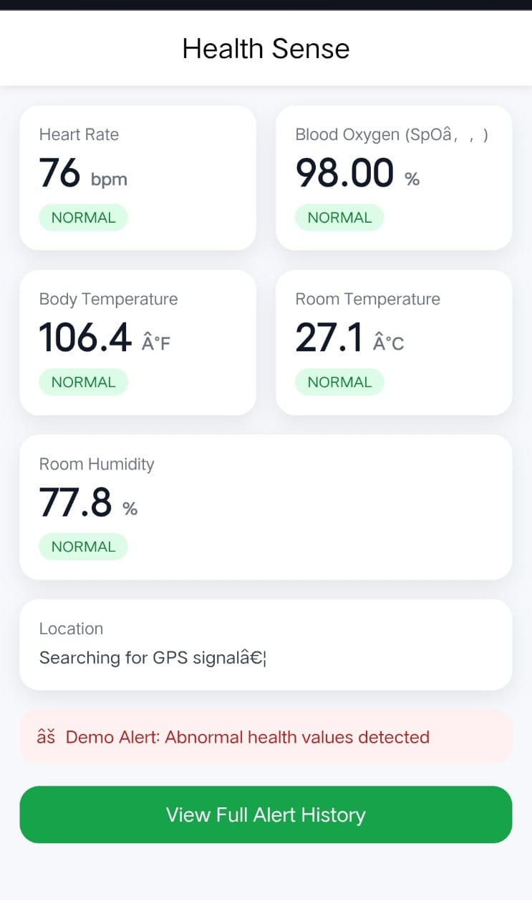

# Health Sense - Wearable Vital Tracker

## 📌 Overview
Health Sense is an IoT-based wearable vital tracking system designed to monitor physiological and environmental parameters in real-time using ESP32.

## 🚀 Features
- Real-time monitoring of vital parameters
- Multi-sensor integration (Heart rate, SpO₂, ECG, Body Temperature)
- Environmental monitoring (Temperature & Humidity)
- OLED display output
- Serial Monitor output
- Web interface for live monitoring
- GPS-based tracking
- Alert system for abnormal readings

## 🛠️ Technologies Used
- ESP32 Microcontroller
- Arduino IDE (Embedded C)
- Sensors (MAX30102, AD8232, MLX90614, DHT22, BMP180)
- OLED Display
- HTML (Web Interface)
- GPS Module

## ⚙️ Working
Sensors collect real-time data and send it to ESP32.  
The processed data is displayed on:
- OLED Display  
- Serial Monitor  
- Web Interface  

## 📊 Applications
- Wearable health monitoring
- Smart healthcare systems
- Remote patient monitoring

## 📈 Results
The system successfully monitored multiple health parameters in real-time with good accuracy and reliability.

## 🔮 Future Scope
- AI-based health prediction
- Advanced data visualization
- Mobile app integration

- ## 📸 Project Images

### Breadboard Connection

### Flowchart

### PCB Design

### Serial Monitor Output

### Web Interface Output

## 👨‍💻 Author
Balakumaran  
Final Year ECE Student
